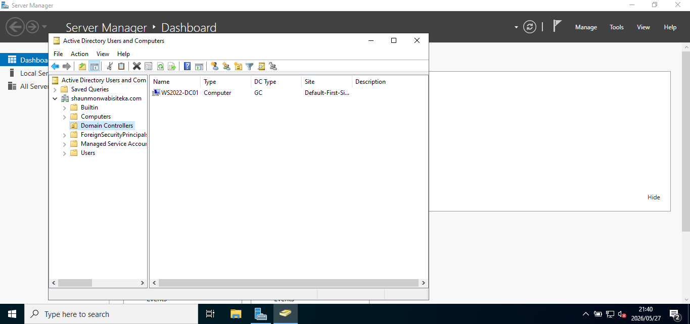

# Active Directory Lab — Windows Server 2022

## Overview

This project demonstrates the deployment and configuration of a Windows Server 2022 Active Directory environment using VirtualBox.

The lab was designed to simulate a small enterprise infrastructure environment including:

* Active Directory Domain Services (AD DS)
* DNS Configuration
* DHCP Configuration
* Domain Controller Promotion
* Reverse Lookup Zones
* Domain Joining
* User & Computer Management

---

# Lab Environment

## Technologies Used

* Windows Server 2022
* Windows 10 Client
* VirtualBox
* Active Directory Domain Services (AD DS)
* DNS
* DHCP

---

# Objectives

* Configure a Domain Controller
* Install and configure Active Directory
* Configure DNS Services
* Configure DHCP Services
* Create and manage domains
* Configure reverse lookup zones
* Join a client machine to the domain
* Simulate an enterprise network environment

---

# Domain Information

| Configuration           | Value                  |
| ----------------------- | ---------------------- |
| Domain Name             | shaunmonwabisiteka.com |
| Server Role             | Domain Controller      |
| Client Machine          | Windows10-VM00         |
| Virtualization Platform | VirtualBox             |

---

# Lab Configuration Process

## 1. Server Installation & Initial Configuration

Configured:

* Windows Server 2022
* Network connectivity
* Server hostname
* Timezone settings

### Screenshot

---

## 2. Active Directory & DNS Installation

Installed:

* Active Directory Domain Services
* DNS Server

### Screenshot

---

## 3. Active Directory Promotion

Promoted the server to a Domain Controller and created a new forest.

### Screenshot

### Screenshot

---

## 4. Domain Creation

Successfully created the domain:
shaunmonwabisiteka.com

### Screenshot

---

# DNS Configuration

Configured:

* Forward Lookup Zones
* Reverse Lookup Zones
* PTR Records

### Screenshot

### Screenshot

---

# DHCP Configuration

Configured DHCP services for automatic IP address assignment.

### Configuration Included:

* IPv4 Scope Configuration
* DHCP Scope Range
* DHCP Security Groups
* DHCP Activation

### Scope Details

| Configuration | Value         |
| ------------- | ------------- |
| Start IP      | 192.168.1.100 |
| End IP        | 192.168.1.254 |

### Screenshot

### Screenshot

---

# Active Directory Tools

Used:

* Active Directory Users & Computers
* DNS Management Console
* DHCP Console

### Screenshot

---

# Domain Join

Successfully joined the Windows 10 client machine to the:
shaunmonwabisiteka.com domain.

### Screenshot

---

# Skills Demonstrated

* Windows Server Administration
* Active Directory Configuration
* DNS Administration
* DHCP Administration
* Network Infrastructure
* Virtualization
* Enterprise Environment Setup
* Identity & Access Management

---

# Lessons Learned

This lab strengthened my understanding of:

* Enterprise infrastructure deployment
* Active Directory architecture
* Domain services
* DNS & DHCP integration
* Client-server communication
* Windows Server administration

---

# Future Improvements

* Group Policy Configuration
* Organizational Units (OUs)
* User & Group Management
* Security Hardening
* SIEM Integration
* Windows Event Monitoring
