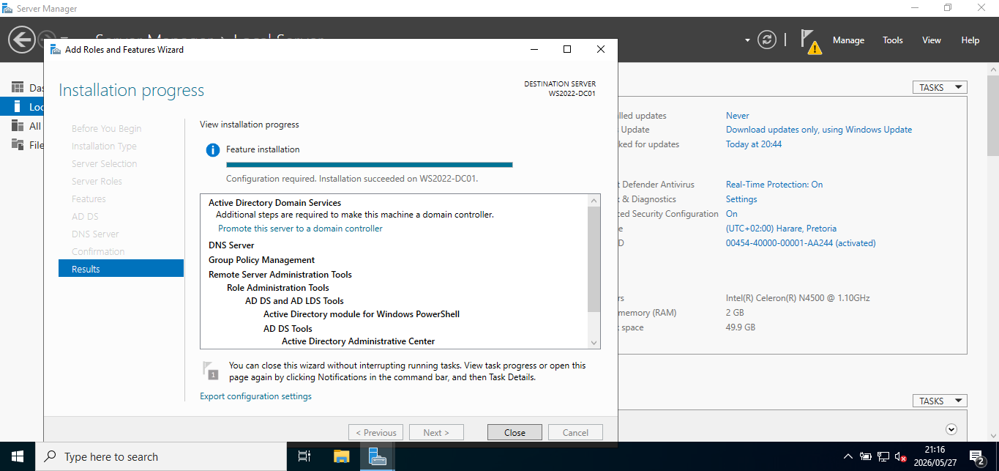
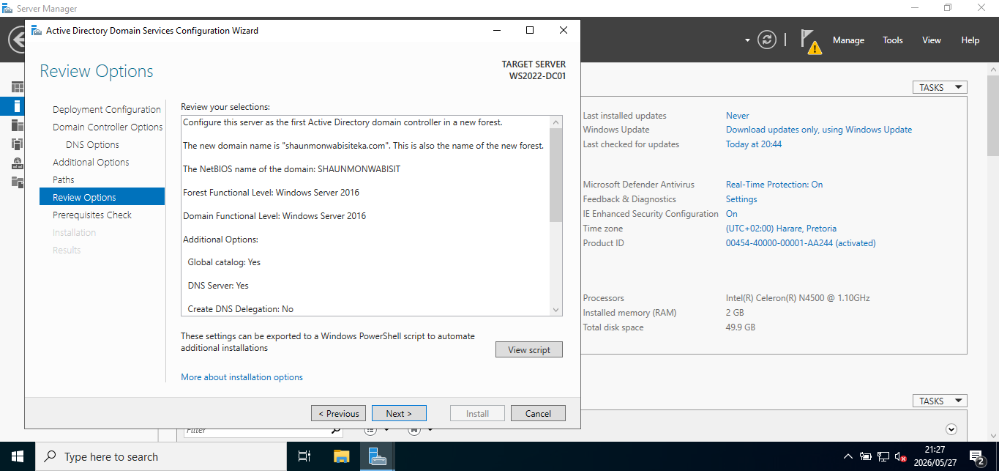
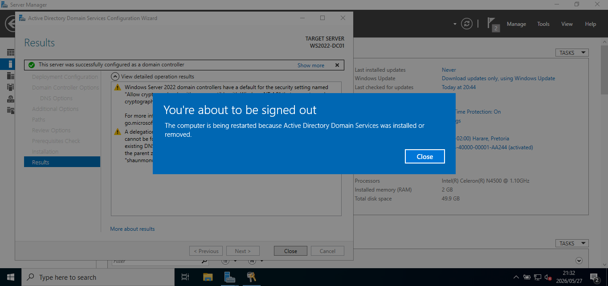
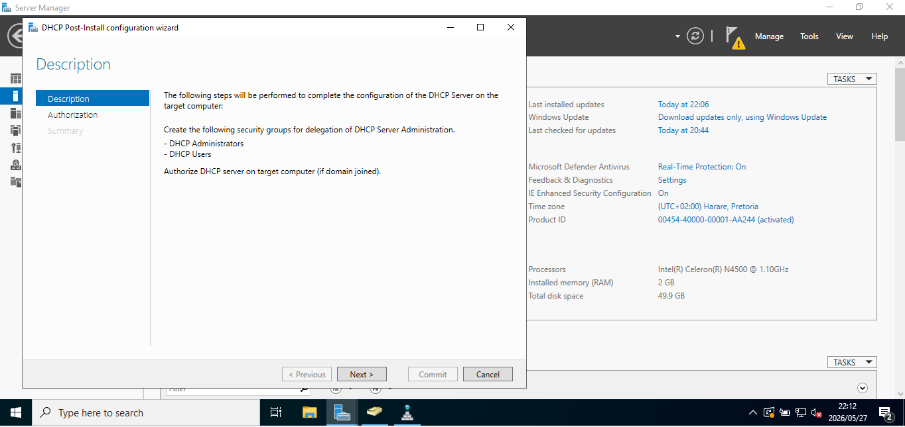
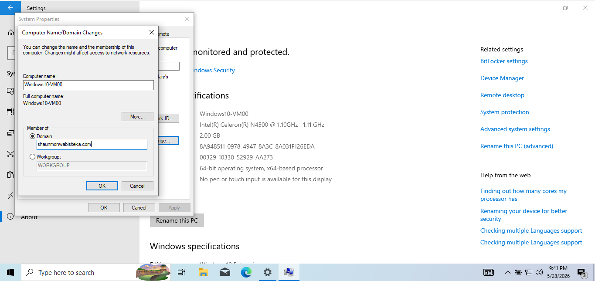

# Active Directory Lab — Windows Server 2022

## Overview

This project demonstrates the deployment and configuration of a Windows Server 2022 Active Directory environment using VirtualBox. The lab simulates a small enterprise infrastructure environment with integrated Active Directory, DNS, DHCP, and Windows client domain management.

The environment was built to strengthen practical skills in:
- Windows Server Administration
- Active Directory Domain Services (AD DS)
- DNS & DHCP Configuration
- Enterprise Network Infrastructure
- Identity & Access Management
- Virtualization Technologies

---

# Lab Environment

## Technologies Used

- Windows Server 2022
- Windows 10 Client
- VirtualBox
- Active Directory Domain Services (AD DS)
- DNS
- DHCP

---

# Objectives

- Configure a Windows Server 2022 Domain Controller
- Install and configure Active Directory Domain Services
- Configure DNS Services
- Configure DHCP Services
- Create and manage a domain environment
- Configure reverse lookup zones and PTR records
- Join a Windows 10 client machine to the domain
- Simulate a small enterprise network infrastructure

---

# Domain Information

| Configuration | Value |
|---|---|
| Domain Name | shaunmonwabisiteka.com |
| Server Role | Domain Controller |
| Client Machine | Windows10-VM00 |
| Virtualization Platform | VirtualBox |

---

# Lab Configuration Process

## 1. Server Installation & Initial Configuration

Performed the initial configuration of Windows Server 2022, including:
- Network connectivity
- Server hostname configuration
- Timezone configuration
- Server preparation for Active Directory deployment

### Screenshot

---

## 2. Active Directory & DNS Installation

Installed:
- Active Directory Domain Services (AD DS)
- DNS Server

### Screenshot

### Screenshot

---

## 3. Active Directory Domain Controller Promotion

Promoted the Windows Server to a Domain Controller and configured a new forest for the enterprise environment.

### Screenshot

### Screenshot

### Screenshot

---

## 4. Domain Creation

Successfully created the:
shaunmonwabisiteka.com domain.

### Screenshot

### Screenshot

---

# DNS Configuration

Configured DNS services including:
- Forward Lookup Zones
- Reverse Lookup Zones
- PTR Records

### Screenshot

### Screenshot

### Screenshot

---

# DHCP Configuration

Installed and configured DHCP services for automatic IP address assignment within the enterprise environment.

### DHCP Configuration Included

- DHCP Role Installation
- DHCP Post-Installation Configuration
- IPv4 Scope Configuration
- DHCP Scope Range Configuration
- DHCP Security Groups
- DHCP Activation

### Screenshot

### Screenshot

### Screenshot

### Screenshot

---

## IP Address Scope Configuration

Configured the DHCP IPv4 scope for automatic client IP address assignment.

### Scope Details

| Configuration | Value |
|---|---|
| Start IP Address | 192.168.1.100 |
| End IP Address | 192.168.1.254 |

### Screenshot

### Screenshot

---

# Active Directory Administrative Tools

Used the following administrative tools:
- Active Directory Users & Computers
- DNS Management Console
- DHCP Management Console

### Screenshot

---

# Domain Join Configuration

Successfully joined the Windows 10 client machine (Windows10-VM00) to the:
shaunmonwabisiteka.com domain.

### Screenshot

---

# Skills Demonstrated

- Windows Server 2022 Administration
- Active Directory Configuration
- DNS Administration
- DHCP Administration
- Network Infrastructure Management
- Domain Controller Deployment
- Identity & Access Management
- Enterprise Environment Simulation
- Virtualization using VirtualBox

---

# Lessons Learned

This lab strengthened my practical understanding of:
- Enterprise infrastructure deployment
- Active Directory architecture
- DNS & DHCP integration
- Domain management
- Client-server communication
- Windows Server administration
- Network service configuration
- Virtualized enterprise environments

---

# Future Improvements

Planned future enhancements for the lab include:
- Group Policy Configuration
- Organizational Units (OUs)
- Advanced User & Group Management
- Windows Security Hardening
- SIEM Integration
- Windows Event Monitoring
- Security Baseline Configuration
- Threat Detection & Log Analysis
