# Active Directory Lab — Windows Server 2022

## Overview

This project demonstrates the deployment and configuration of a Windows Server 2022 Active Directory environment using VirtualBox. The lab simulates a small enterprise infrastructure environment with integrated Active Directory, DNS, DHCP, and Windows client domain management.

The environment was built to strengthen practical skills in:
- Windows Server Administration
- Active Directory Domain Services (AD DS)
- DNS & DHCP Configuration
- Enterprise Network Infrastructure
- Identity & Access Management
- Virtualization Technologies

---

# Lab Environment

## Technologies Used

- Windows Server 2022
- Windows 10 Client
- VirtualBox
- Active Directory Domain Services (AD DS)
- DNS
- DHCP

---

# Objectives

- Configure a Windows Server 2022 Domain Controller
- Install and configure Active Directory Domain Services
- Configure DNS Services
- Configure DHCP Services
- Create and manage a domain environment
- Configure reverse lookup zones and PTR records
- Join a Windows 10 client machine to the domain
- Simulate a small enterprise network infrastructure

---

# Domain Information

| Configuration | Value |
|---|---|
| Domain Name | shaunmonwabisiteka.com |
| Server Role | Domain Controller |
| Client Machine | Windows10-VM00 |
| Virtualization Platform | VirtualBox |

---

# Lab Configuration Process

## 1. Server Installation & Initial Configuration

Performed the initial configuration of Windows Server 2022, including:
- Network connectivity
- Server hostname configuration
- Timezone configuration
- Server preparation for Active Directory deployment

### Server installed

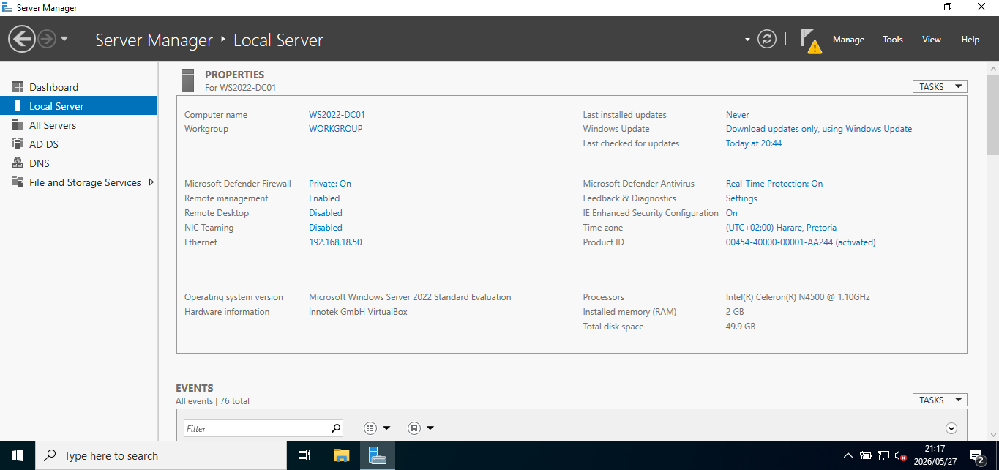

---

## 2. Active Directory & DNS Installation

Installed:
- Active Directory Domain Services (AD DS)
- DNS Server

### Active Driectory & DNS installation

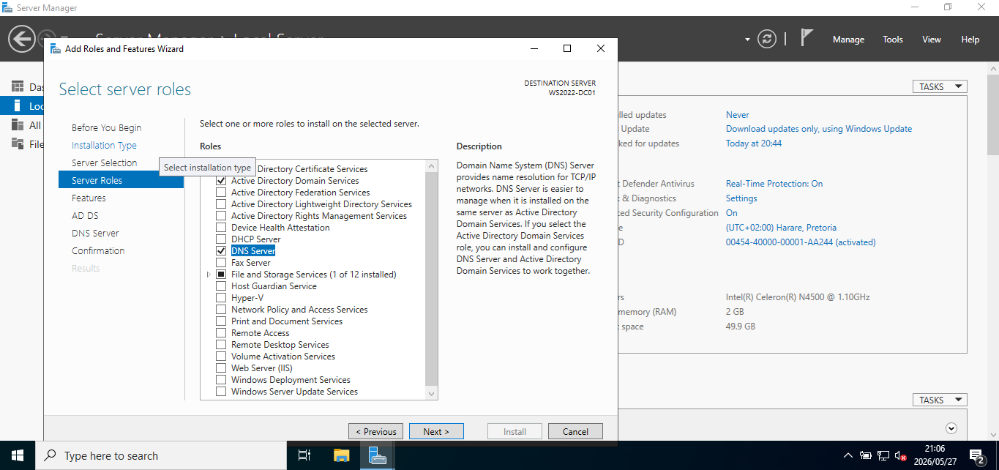

### Active Driectory & DNS successfully installed

---

## 3. Active Directory Domain Controller Promotion

Promoted the Windows Server to a Domain Controller and configured a new forest for the enterprise environment.

### Promoting Server

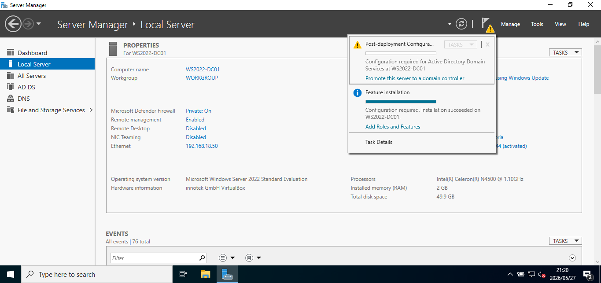

### Active Directory Promotion Options

### Active Directory Promotion Succeeded

---

## 4. Domain Creation

Successfully created the:
shaunmonwabisiteka.com domain.

### Domain created

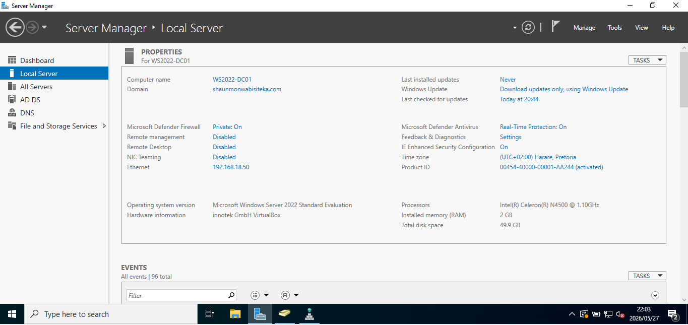

### Adding A New Forest

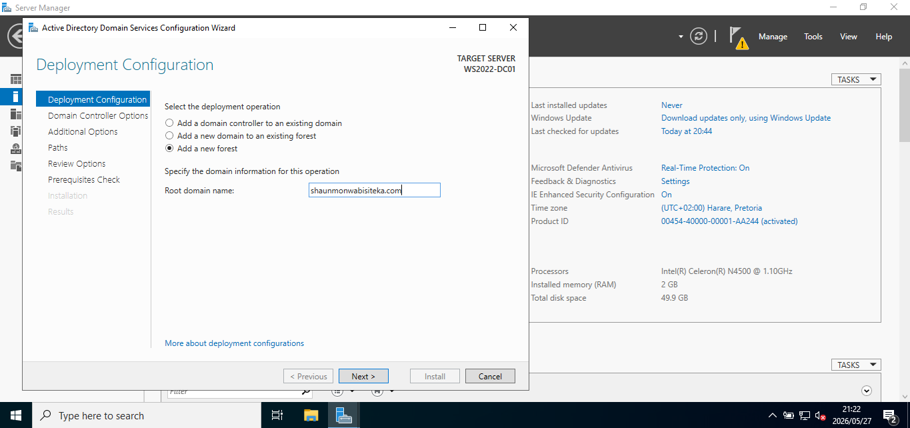

---

# DHCP Configuration

Installed and configured DHCP services for automatic IP address assignment within the enterprise environment.

### DHCP Configuration Included

- DHCP Role Installation
- DHCP Post-Installation Configuration
- IPv4 Scope Configuration
- DHCP Scope Range Configuration
- DHCP Security Groups
- DHCP Activation

### DHCP Installation

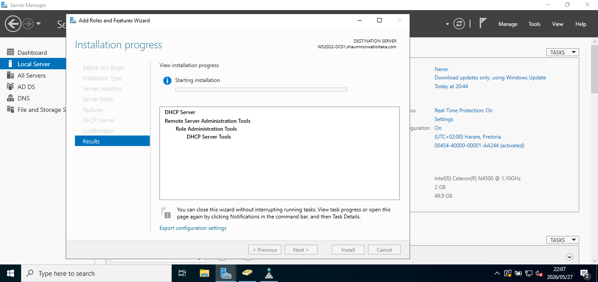

### DHCP Post Installation

### DHCP Console

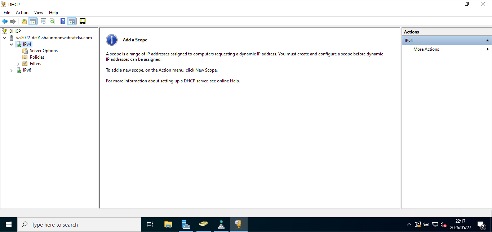

### DHCP Scope

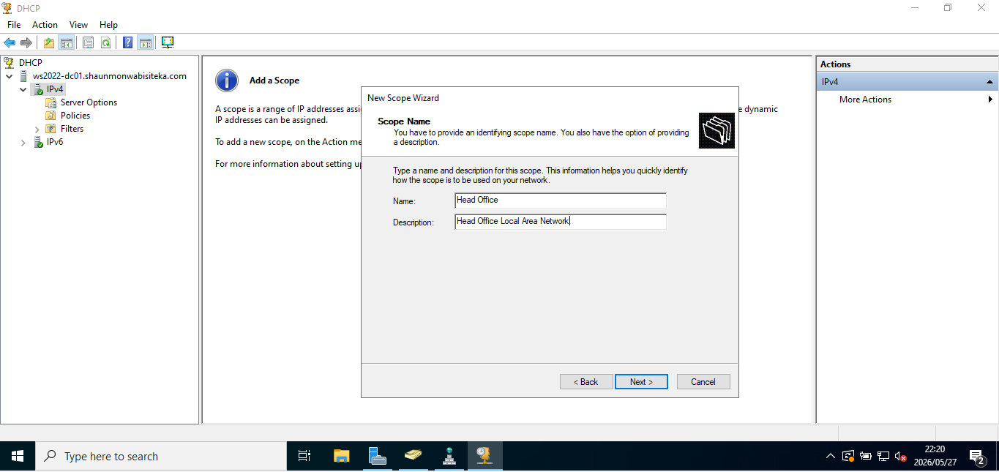

---

## IP Address Scope Configuration

Configured the DHCP IPv4 scope for automatic client IP address assignment.

### Scope Details

| Configuration | Value |
|---|---|
| Start IP Address | 192.168.1.100 |
| End IP Address | 192.168.1.254 |

### IP Address Range

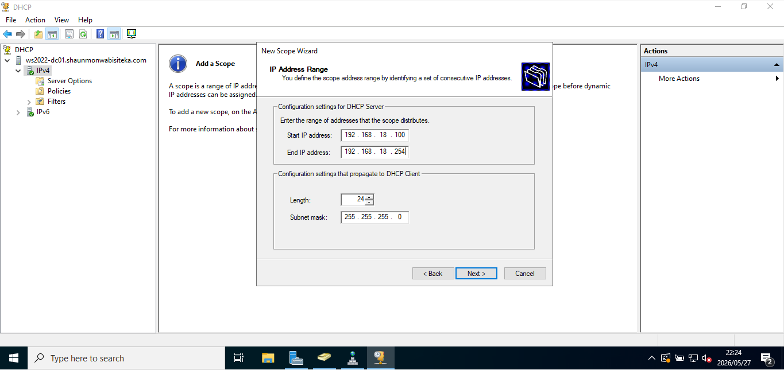

### DHCP Active

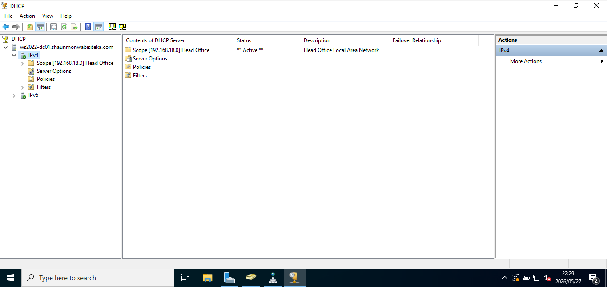

---

# DNS Configuration

Configured DNS services including:
- Forward Lookup Zones
- Reverse Lookup Zones
- PTR Records

### Reverse Lookup Zone

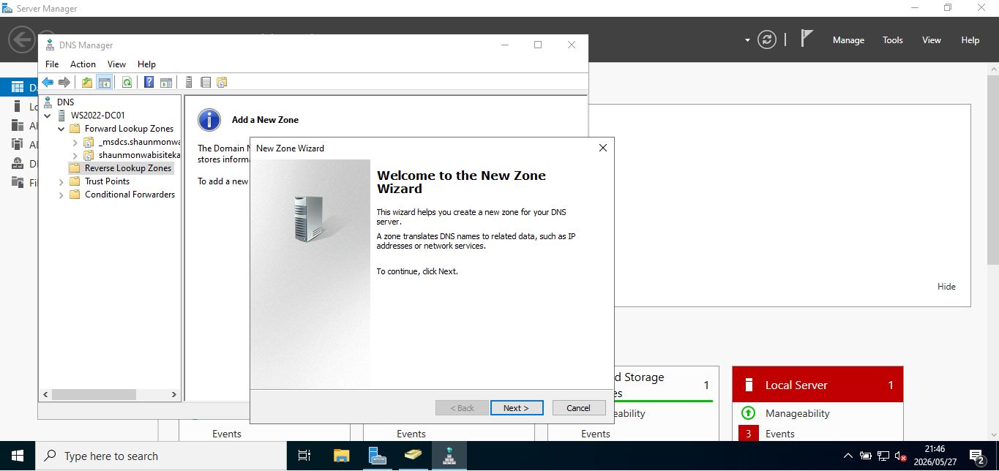

### Active Directory Users & Computers

### DNS Tools

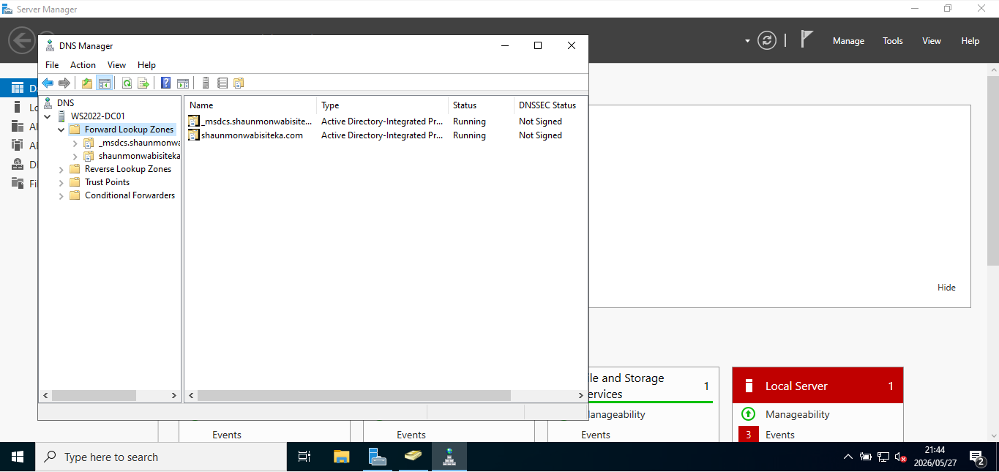

---

# Active Directory Administrative Tools

Used the following administrative tools:
- Active Directory Users & Computers
- DNS Management Console
- DHCP Management Console

### PTR Record

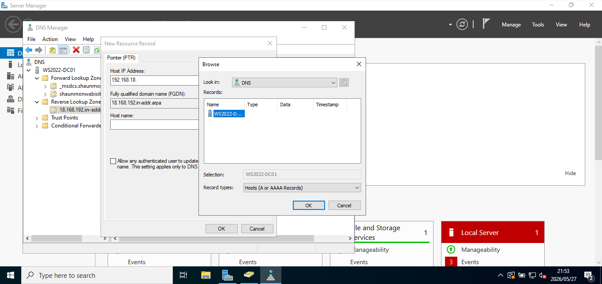

---

# Domain Join Configuration

Successfully joined the Windows 10 client machine (Windows10-VM00) to the:
shaunmonwabisiteka.com domain.

### Domain Join

---

### Domain Join Credentials

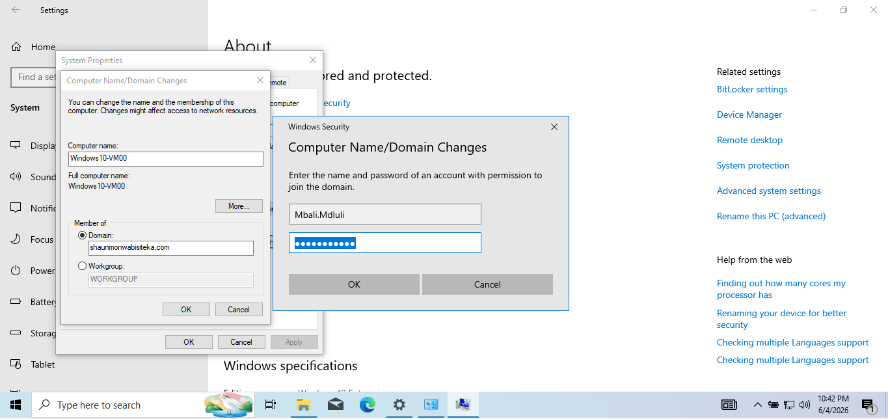

Entered domain administrator credentials to authorize the Windows 10 client machine to join the Active Directory domain.

This step validates that only authorized administrators can add devices to the domain environment.

---

### Domain Joined Successfully

The Windows 10 client machine was successfully joined to the Active Directory domain.

This confirms secure communication between the client workstation and the domain controller, enabling centralized identity and access management.

---

### Restart Required

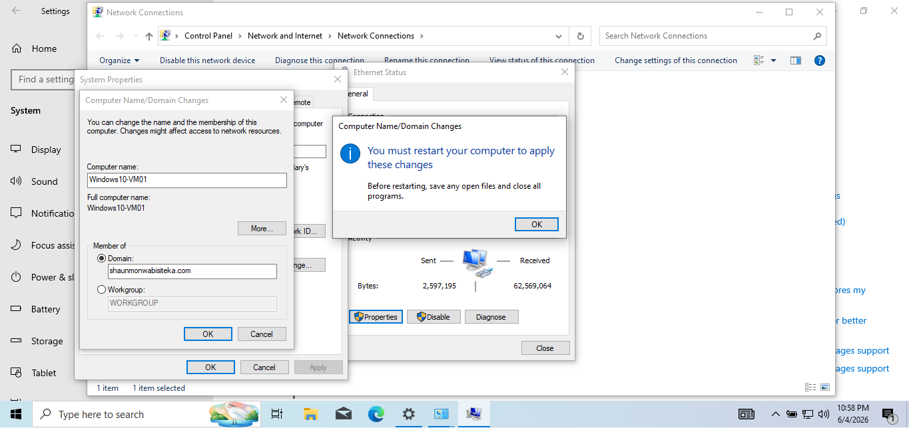

Windows prompted for a system restart to apply the domain membership changes.

A restart is required to complete the domain join process and update the machine's authentication relationship with the domain controller.

---

### Domain User Sign-In

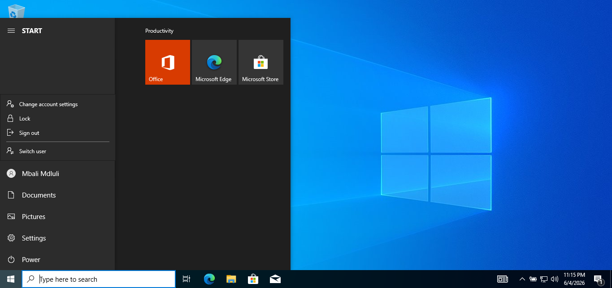

Successfully signed in to the Windows 10 client machine using Active Directory domain credentials.

This confirms that domain authentication is functioning correctly and that users can access organizational resources using centralized Active Directory accounts.

---

## Outcome

✅ Successfully joined a Windows 10 client machine to the Active Directory domain.

✅ Verified domain authentication using Active Directory user credentials.

✅ Demonstrated centralized identity and access management through Active Directory.

✅ Validated communication between the client workstation and domain controller.

---

# Skills Demonstrated

- Windows Server 2022 Administration
- Active Directory Configuration
- DNS Administration
- DHCP Administration
- Network Infrastructure Management
- Domain Controller Deployment
- Identity & Access Management
- Enterprise Environment Simulation
- Virtualization using VirtualBox

---

# Lessons Learned

This lab strengthened my practical understanding of:
- Enterprise infrastructure deployment
- Active Directory architecture
- DNS & DHCP integration
- Domain management
- Client-server communication
- Windows Server administration
- Network service configuration
- Virtualized enterprise environments

---

