# 🔐 Configuring BitLocker Recovery Keys in Active Directory

## 📖 Overview

This lab demonstrates how to configure **Active Directory Domain Services (AD DS)** to securely store and manage **BitLocker Recovery Keys**. The objective was to enable centralized recovery key management, configure Group Policy settings for BitLocker, and validate policy deployment on a Windows 10 client machine.

Storing BitLocker Recovery Keys in Active Directory improves security, simplifies recovery processes, and ensures compliance with enterprise security standards.

---

# 🛠️ Technologies Used

- Windows Server 2022
- Active Directory Domain Services (AD DS)
- Group Policy Management (GPM)
- BitLocker Drive Encryption
- Windows 10 Client
- VirtualBox

---

# 🎯 Objectives

- Install BitLocker administration tools
- Enable BitLocker Recovery Key Viewer
- Configure Group Policy for BitLocker recovery
- Store recovery keys in Active Directory
- Configure operating system drive encryption
- Apply BitLocker policies through Group Policy
- Validate policy deployment on client devices

---

# 🧪 Lab Activities

## 1️⃣ Verifying BitLocker Recovery Support

Opened Active Directory Users and Computers to verify whether BitLocker Recovery information was available for a domain-joined computer.

### Activities Performed

- Opened **Server Manager**
- Selected **Tools**
- Opened **Active Directory Users and Computers**
- Navigated to the target computer object

### 📸 Screenshot

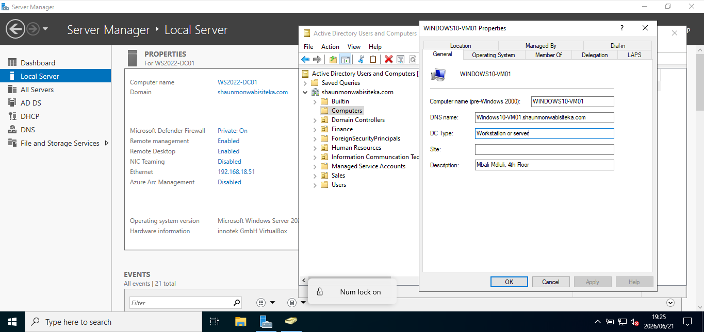

---

## 2️⃣ Installing BitLocker Features

Added the required BitLocker management components.

### Features Installed

- BitLocker Drive Encryption Administration Utilities
- BitLocker Recovery Password Viewer

### 📸 Screenshot

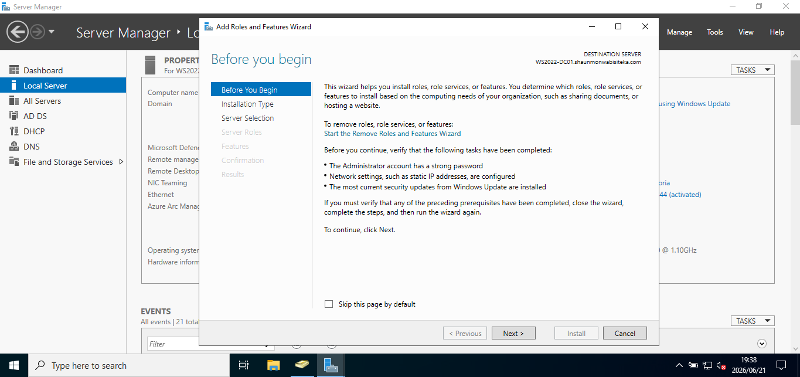

---

## 3️⃣ Selecting BitLocker Components

Configured feature selections required for Active Directory integration.

### 📸 Screenshot

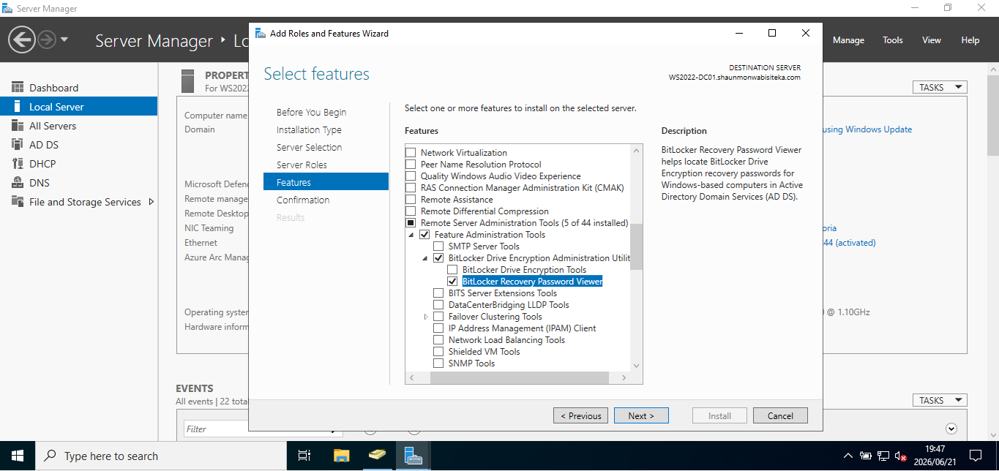

---

## 4️⃣ Installing Features

Started the installation process.

### 📸 Screenshot

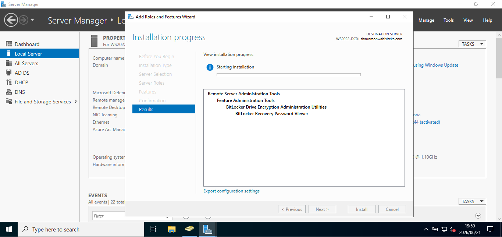

---

## 5️⃣ Installation Completed

Verified successful installation.

### 📸 Screenshot

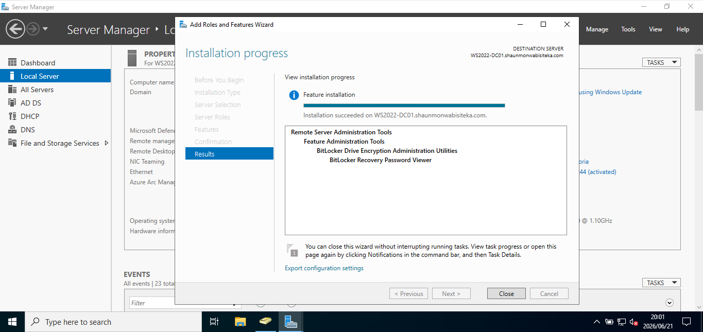

---

## 6️⃣ Verifying BitLocker Recovery Tab

Returned to Active Directory Users and Computers and confirmed that the BitLocker Recovery tab was available.

### Observation

The message:

> "There are no items in this view"

indicated that the computer had not yet been encrypted using BitLocker.

### 📸 Screenshot

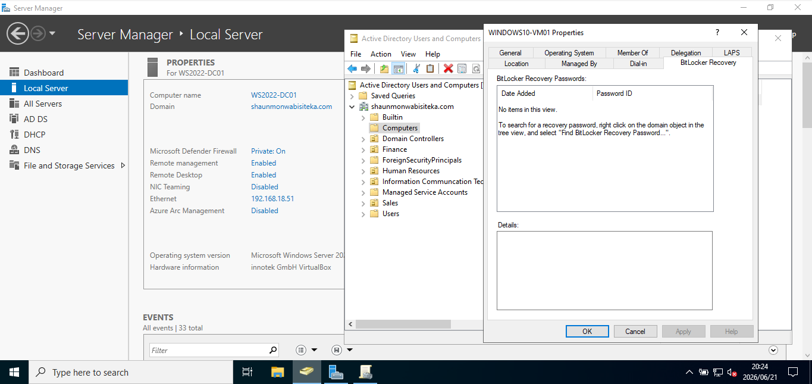

---

# ⚙️ Group Policy Configuration

## 7️⃣ Creating a BitLocker GPO

Created a new Group Policy Object named:

**SMT BitLocker Recovery Key GPO**

### 📸 Screenshot

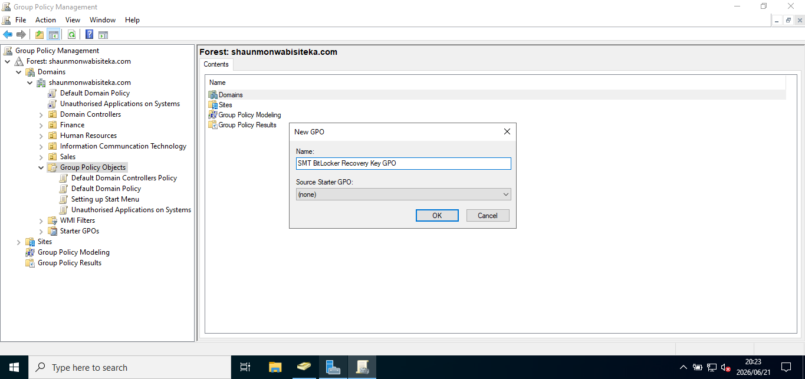

---

## 8️⃣ Editing the GPO

Opened Group Policy Editor and navigated to:

```text
Computer Configuration
 └── Policies
      └── Administrative Templates
           └── Windows Components
                └── BitLocker Drive Encryption
```

### 📸 Screenshot

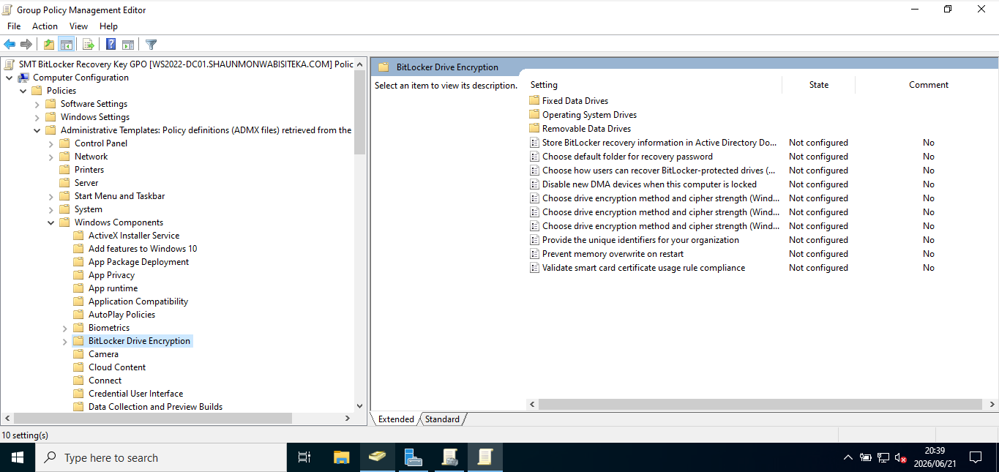

---

## 9️⃣ Configuring Recovery Information Storage

Enabled:

**Store BitLocker Recovery Information in Active Directory Domain Services**

### Configuration Applied

✅ Enabled

✅ Require BitLocker backup to AD DS

### 📸 Screenshot

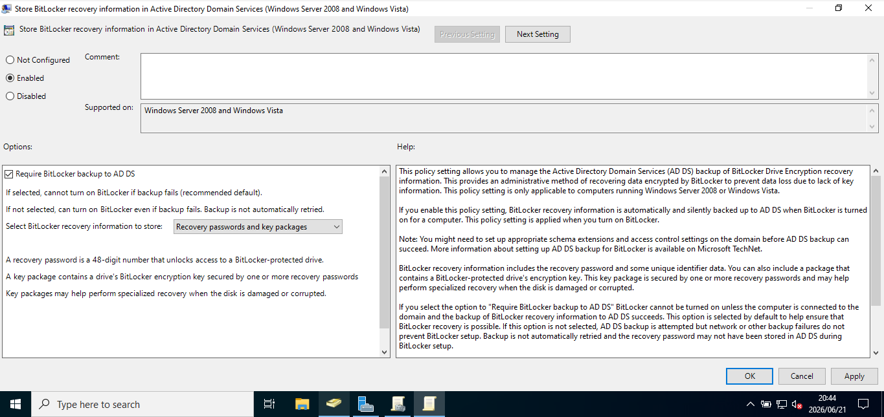

---

## 🔟 Enabling Recovery Key Backup

Configured automatic backup of recovery keys to Active Directory.

### 📸 Screenshot

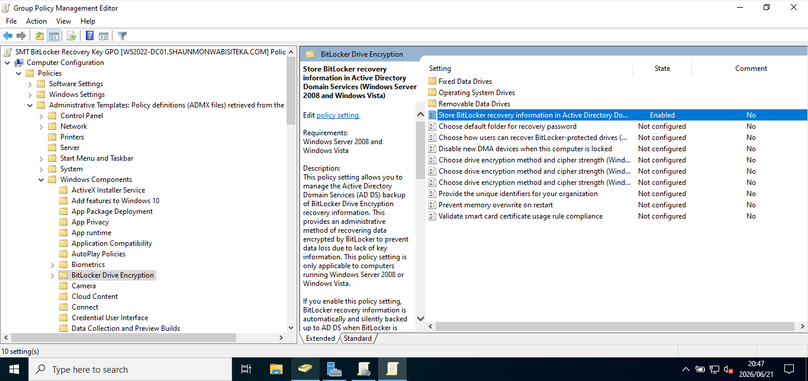

---

## 1️⃣1️⃣ Configuring Operating System Drives

Navigated to:

```text
BitLocker Drive Encryption
 └── Operating System Drives
```

### 📸 Screenshot

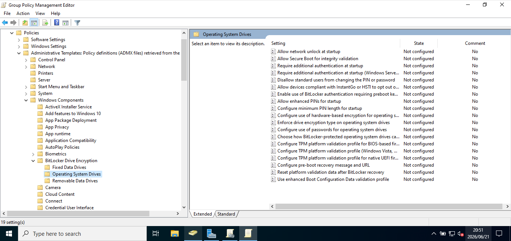

---

## 1️⃣2️⃣ Allowing BitLocker Without TPM

Enabled:

**Require additional authentication at startup**

### Purpose

Allows BitLocker deployment on devices that do not have a Trusted Platform Module (TPM).

### 📸 Screenshot

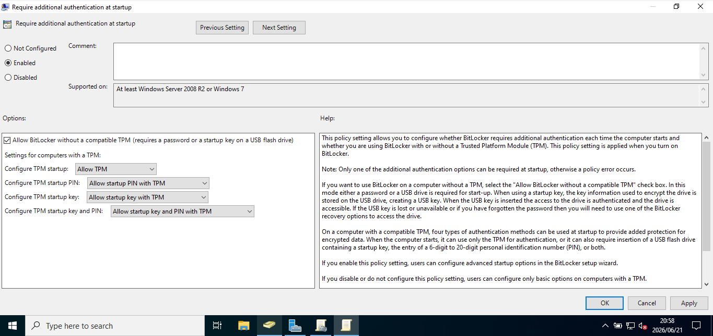

---

## 1️⃣3️⃣ TPM-Free BitLocker Support

Confirmed policy configuration.

### 📸 Screenshot

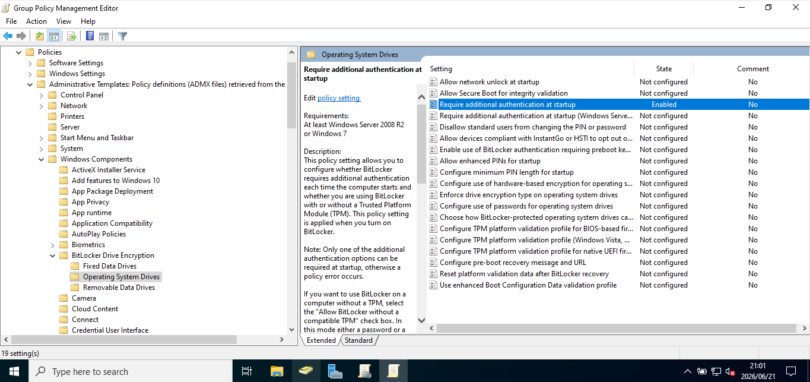

---

## 1️⃣4️⃣ Configuring Encryption Type

Configured:

**Enforce drive encryption type on operating system drives**

### Selected Option

🔒 Used Space Only Encryption

### 📸 Screenshot

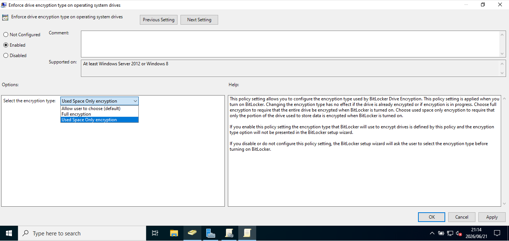

---

## 1️⃣5️⃣ Configuring Recovery Options

Opened:

**Choose how BitLocker-protected operating system drives can be recovered**

### 📸 Screenshot

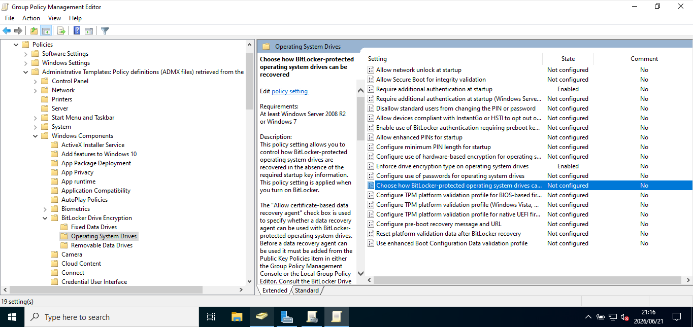

---

## 1️⃣6️⃣ Requiring Recovery Information Storage

Enabled:

✅ Do not enable BitLocker until recovery information is stored to AD DS

### Benefit

Ensures recovery keys are securely backed up before encryption begins.

### 📸 Screenshot

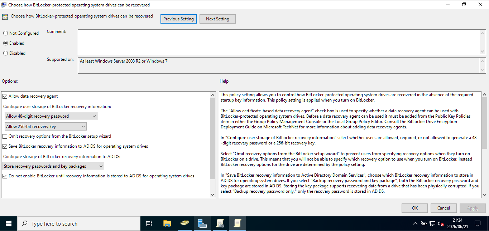

---

## 1️⃣7️⃣ Linking the GPO

Prepared to deploy the policy across Organizational Units (OUs).

### 📸 Screenshot

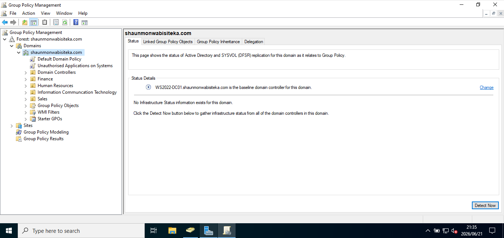

---

## 1️⃣8️⃣ Deploying to Human Resources

Linked the policy to the:

👥 Human Resources Computers OU

### 📸 Screenshot

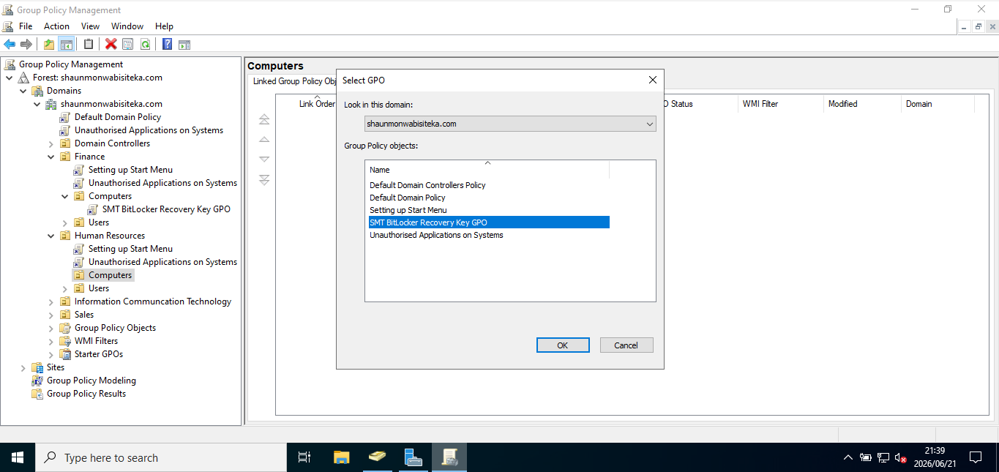

---

# 💻 Client Configuration

## 1️⃣9️⃣ Opening Command Prompt

Opened Command Prompt from the Run dialog.

### 📸 Screenshot

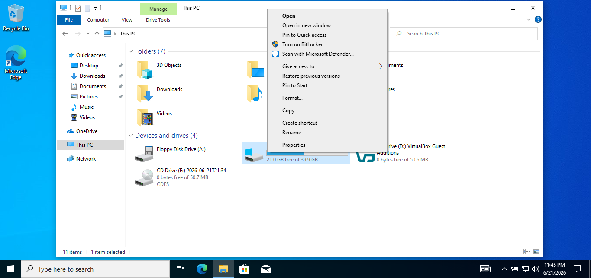

---

## 2️⃣0️⃣ Applying Group Policy

Executed:

```powershell
gpupdate /force
```

### Purpose

Refreshes and applies the latest Group Policy settings from the domain controller.

### Additional Command

```powershell
shutdown -r -t 0
```

### Purpose

Immediately restarts the client computer.

### 📸 Screenshot


---

# 🔒 Enabling BitLocker on the Client

## 2️⃣1️⃣ Turning On BitLocker

Navigated to:

**This PC → Local Disk (C:) → Turn on BitLocker**

### 📸 Screenshot

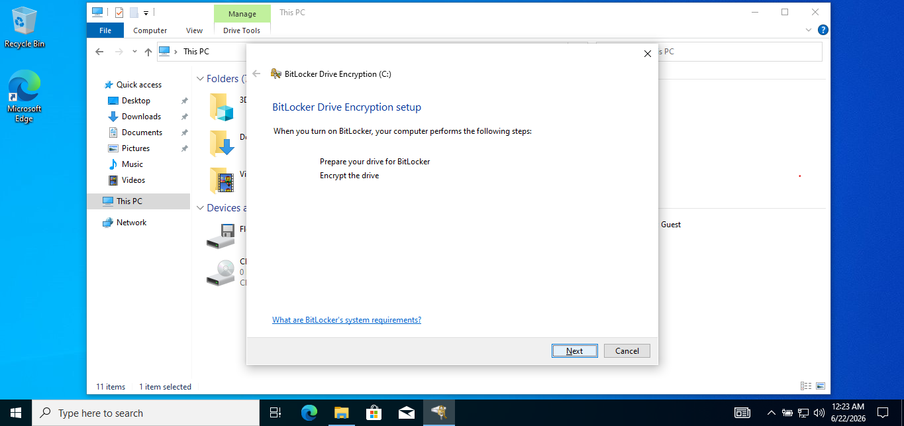

---

## 2️⃣2️⃣ Verifying System Requirements

BitLocker verified that the device met the required prerequisites.

### 📸 Screenshot

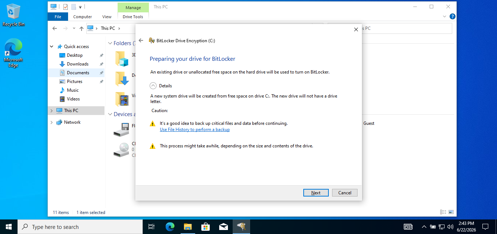

---

## 2️⃣3️⃣ Preparing the Drive

BitLocker prepared the operating system drive for encryption.

### 📸 Screenshot

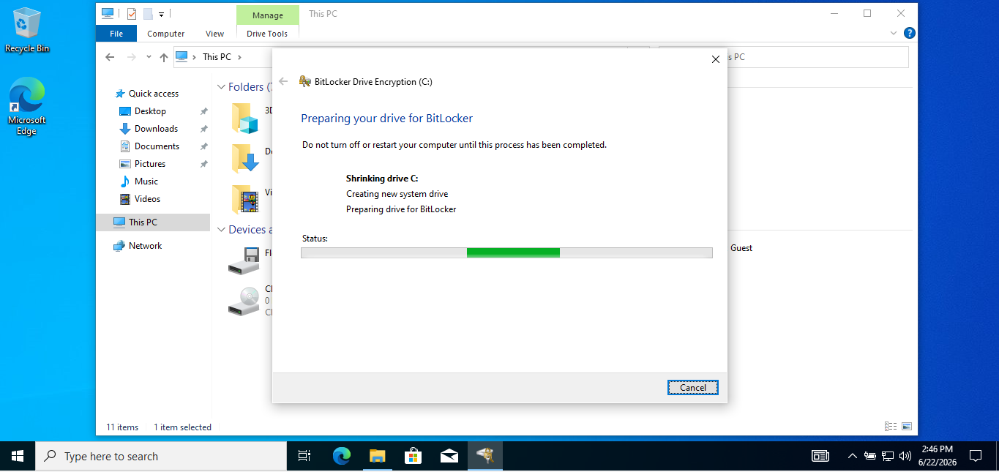

---

## 2️⃣4️⃣ Selecting Startup Authentication

Because the device does not contain a TPM chip, a startup authentication method was selected.

### 📸 Screenshot


---

## 2️⃣5️⃣ Preparing Recovery Key Configuration

Configured BitLocker Recovery settings before encryption.

### 📸 Screenshot


---

# 🚀 Skills Demonstrated

- Active Directory Administration
- BitLocker Administration
- Group Policy Management
- Endpoint Security
- Windows Server Administration
- Identity & Access Management (IAM)
- Security Hardening
- Enterprise Encryption Management
- Recovery Key Management

---

# 📚 Lessons Learned

This lab strengthened my understanding of:

- BitLocker deployment strategies
- Recovery key management
- Active Directory integration
- Group Policy administration
- Endpoint encryption
- Enterprise security controls
- Data protection best practices

---

# 🔮 Future Improvements

- BitLocker Network Unlock
- TPM-Based Deployments
- MBAM Integration
- Azure AD Recovery Key Backup
- Microsoft Intune BitLocker Management
- Endpoint Compliance Policies
- Security Baseline Configuration
- Device Encryption Monitoring

---

## ✅ Project Status

**Completed Successfully**

This project demonstrates practical experience in **BitLocker Administration**, **Active Directory Recovery Key Management**, **Group Policy Configuration**, and **Enterprise Endpoint Security** within a Windows Server environment.
````

