# 🛡️ Group Policy Configuration Lab

## 📖 Overview

This lab demonstrates the creation, configuration, and deployment of Group Policy Objects (GPOs) within a Windows Server Active Directory environment. The objective was to enforce organizational security controls and administrative settings through centralized policy management.

The lab focused on creating custom Group Policy Objects, configuring security-related policies, linking GPOs to Organizational Units (OUs), and applying the policies to client devices.

---

# 🛠️ Technologies Used

- Windows Server 2022
- Active Directory Domain Services (AD DS)
- Group Policy Management (GPM)
- Group Policy Management Editor
- Windows 10 Client
- VirtualBox

---

# 🎯 Objectives

- Create and manage Group Policy Objects (GPOs)
- Configure computer-based security policies
- Deploy policies to Organizational Units (OUs)
- Enforce centralized administrative controls
- Validate policy deployment on client systems
- Strengthen endpoint security through Group Policy

---

# 🧪 Lab Activities

## 1️⃣ Accessing Group Policy Management

Opened the Group Policy Management Console from Server Manager to begin configuring domain policies.

### Activities Performed

- Opened Server Manager
- Navigated to **Tools**
- Selected **Group Policy Management**

### Group Policy Management

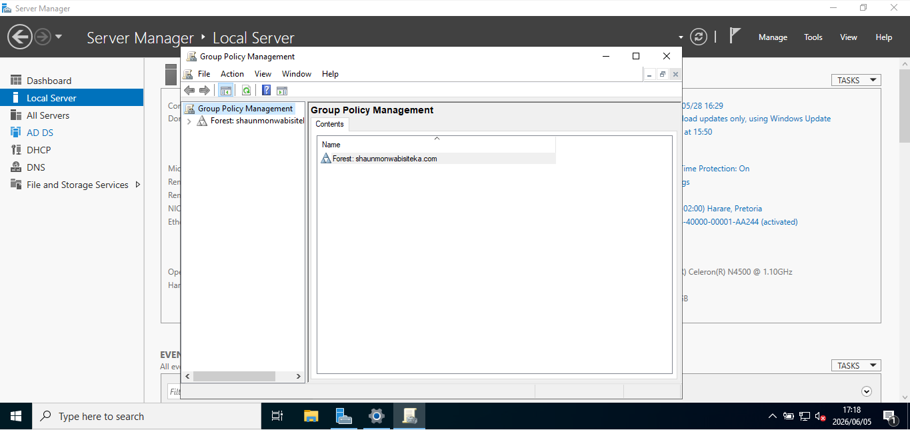

---

## 2️⃣ Reviewing Existing Group Policy Objects

Explored the default Group Policy Objects available within the Active Directory domain.

### Activities Performed

- Expanded the **Domains** node
- Opened **Group Policy Objects**
- Reviewed the default domain policies


### Default Group Policy Objects

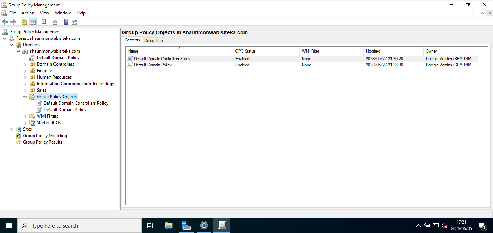

---

## 3️⃣ Creating a New Group Policy Object

Created a new custom Group Policy Object named:

**Setting up Start Menu**

### Activities Performed

- Right-clicked **Group Policy Objects**
- Selected **New**
- Created the custom GPO

### Creating Group Policy Object

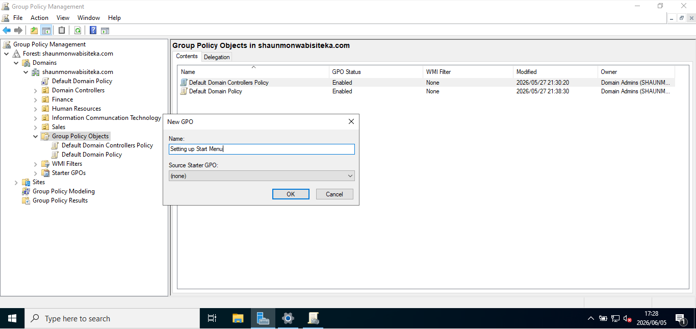

---

## 4️⃣ Reviewing GPO Details

Reviewed the newly created Group Policy Object and its configuration details.

### Activities Performed

- Selected the new GPO
- Opened the **Details** tab

### Group Policy Details

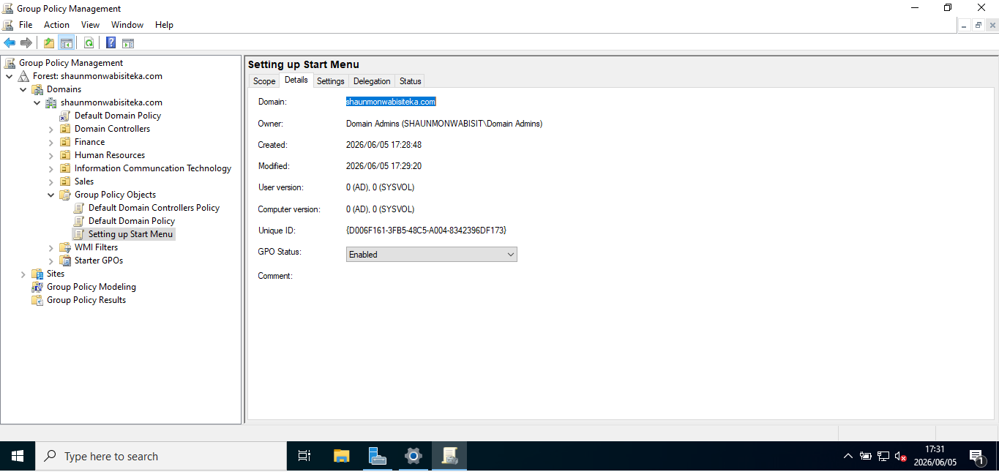

---

## 5️⃣ Editing the Group Policy Object

Opened the Group Policy Management Editor to configure policy settings.

### Activities Performed

- Reviewed:
  - Computer Configuration
  - User Configuration

💡 **Note:** Computer policies apply during system startup, while user policies apply when a user signs in.


### Group Policy Editor

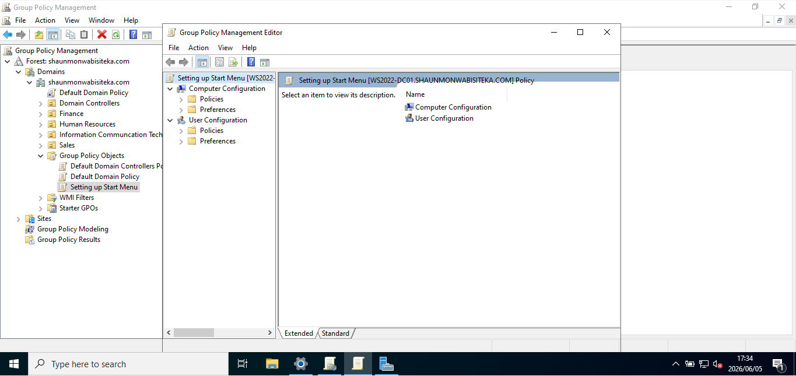

---

## 6️⃣ Configuring Start Menu & Taskbar Policies

Configured security restrictions within Administrative Templates.
### Activities Performed

- Opened:
  - Computer Configuration
  - Policies
  - Administrative Templates
  - Start Menu and Taskbar

### Administrative Templates

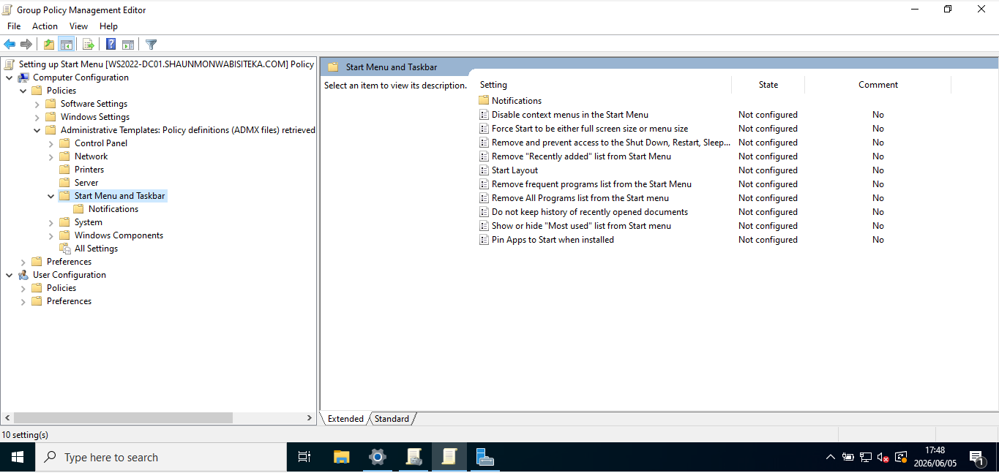

---

## 7️⃣ Restricting Shutdown Options

Configured a policy to prevent users from accessing:

- Shut Down
- Restart
- Sleep
- Hibernate

### 🔒 Security Control Applied

Enabled:
**Remove and prevent access to the Shut Down, Restart, Sleep, and Hibernate commands**
### Shut, Restart, Sleep, and Hibernate Restriction

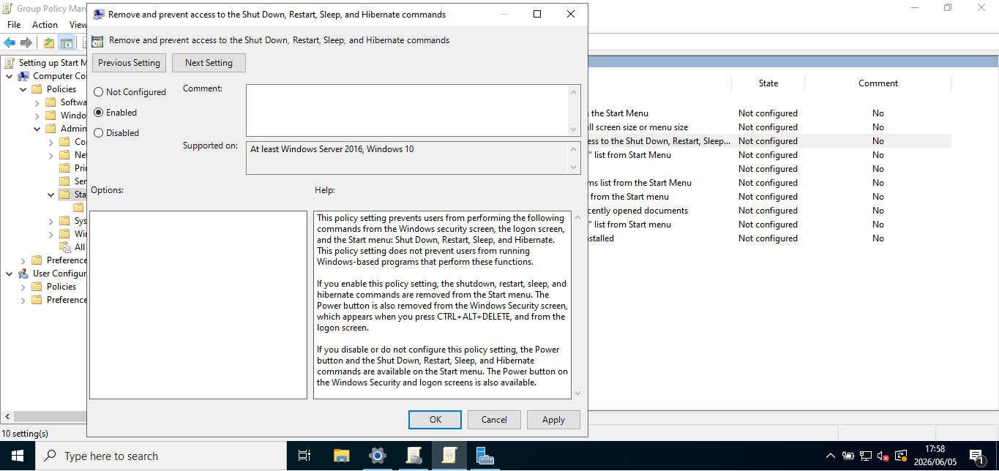

---

## 8️⃣ Verifying Policy Status

Confirmed that the policy was successfully enabled.

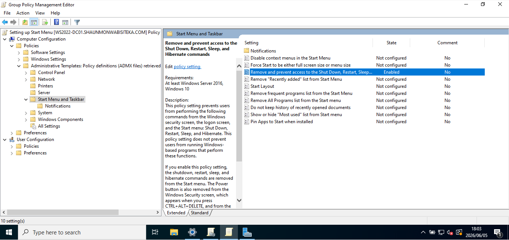

---

## 9️⃣ Restricting Removable Media Installations

Configured a policy to prevent installations from removable media devices.

### 🔒 Security Control Applied

Enabled:
**Prevent removable media source for any installation**

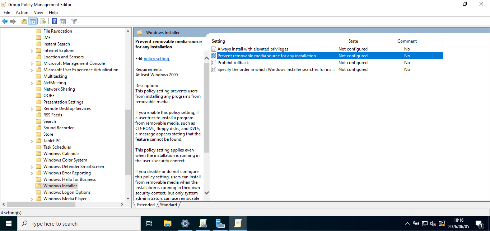

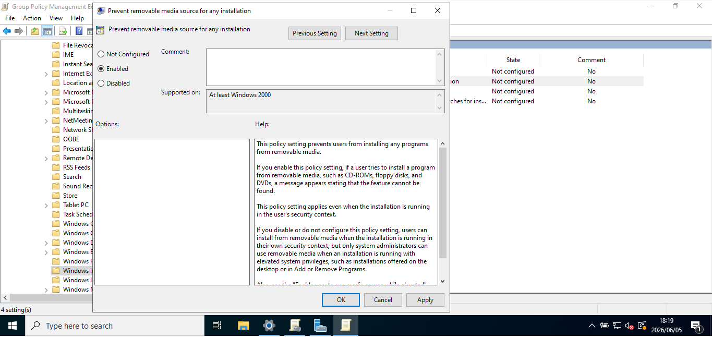

---

## 🔟 Linking the GPO to an Organizational Unit

Linked the newly created GPO to the Finance Organizational Unit (OU).

### Activities Performed

- Selected the **Finance OU**
- Linked the **Setting up Start Menu** GPO

### Linking All Group Policies 

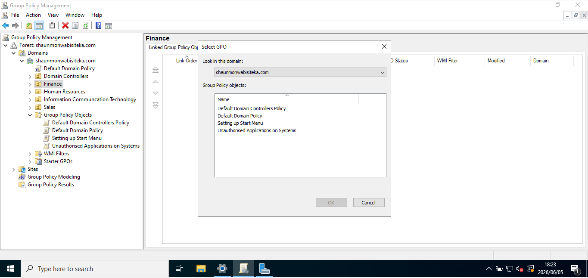

---

## 1️⃣1️⃣ Verifying GPO Deployment

Confirmed that the GPO was successfully linked and configured for enforcement.

### Activities Performed

- Reviewed the **Scope** tab
- Verified policy deployment settings

### Group Policies Linked

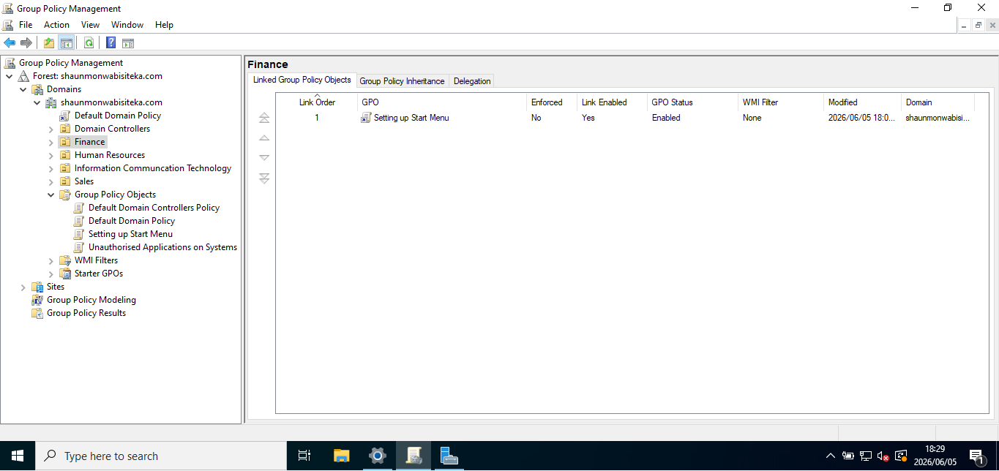

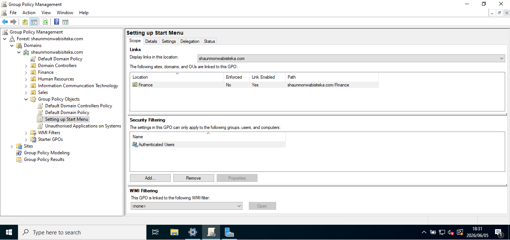

---

## 1️⃣2️⃣ Domain-Wide Policy Deployment

Expanded policy deployment across all Organizational Units within the domain to improve security consistency.

### Domain Wide Deployment

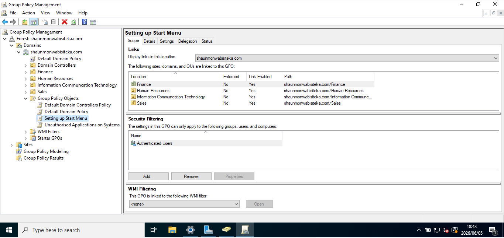

---

## 1️⃣3️⃣ Policy Enforcement on Client Device

Verified policy application on a Windows 10 client machine.

### Activities Performed

- Logged into the client workstation
- Reviewed the system before policy enforcement
- Opened the Run dialog box
- Executed Group Policy update
- Refreshed Group Policy settings
- Confirmed successful policy updates

### 💻 Command Used

```powershell
gpupdate /force
```

### Client Machine Before

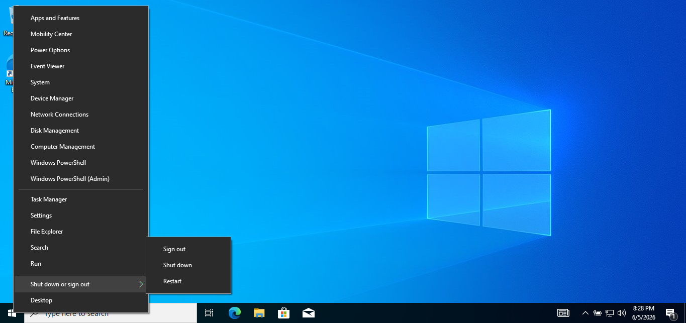

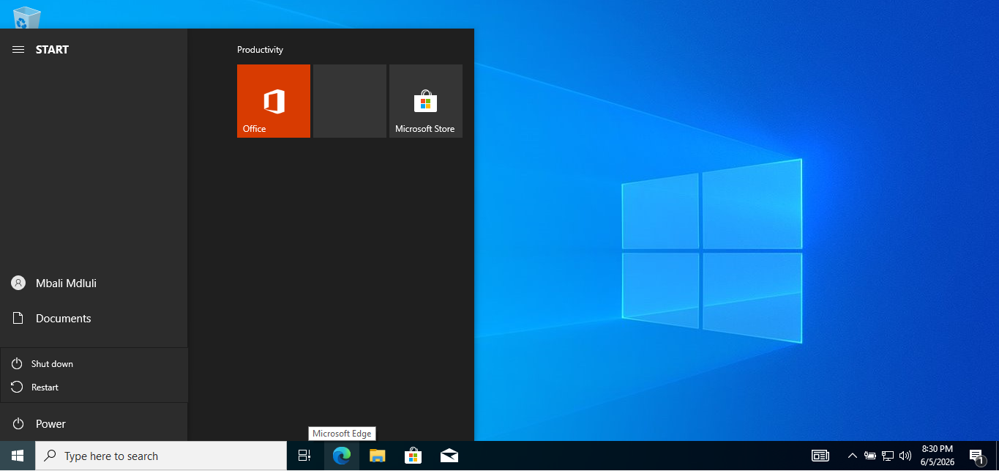

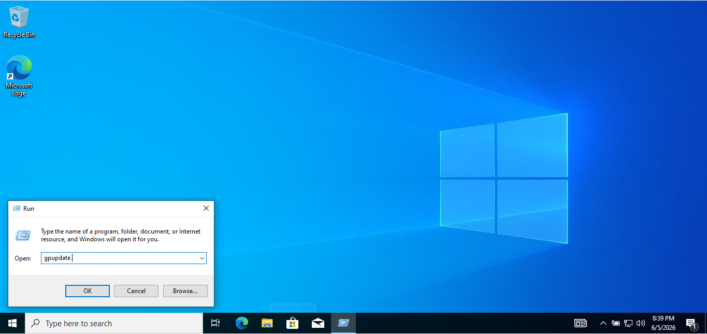

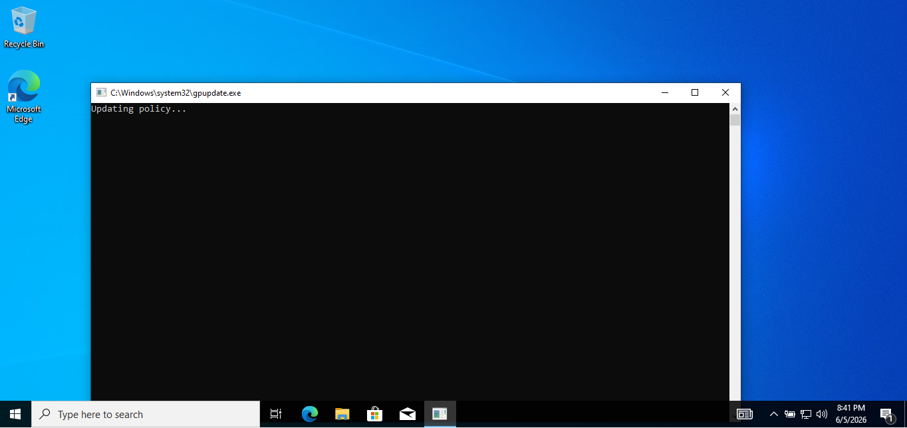

---

# 🚀 Skills Demonstrated

- Active Directory Administration
- Group Policy Management
- Windows Server Administration
- Organizational Unit (OU) Management
- Security Policy Configuration
- Endpoint Hardening
- Identity & Access Management (IAM)
- Enterprise Infrastructure Administration
- Windows Client Management

---

# 📚 Lessons Learned

This lab strengthened my understanding of:

- Group Policy architecture
- Centralized administration
- Security policy deployment
- Organizational Unit management
- Enterprise endpoint security
- Windows Server administration
- Policy enforcement and troubleshooting

---

# 🔮 Future Improvements

Planned future enhancements include:

- Password Policy Configuration
- Account Lockout Policies
- Software Restriction Policies
- Group Policy Preferences
- Windows Security Baselines
- Administrative Template Expansion
- Security Hardening Policies
- Advanced Active Directory Management

## ✅ Project Status

**Completed Successfully**

This project demonstrates practical experience with **Active Directory Group Policy Management**, **Windows Server Administration**, and **Enterprise Security Controls** within a simulated enterprise environment.
