# 🔐 Security Hardening Lab – Fine-Grained Password Policy

## 📖 Overview

This lab demonstrates the implementation of **Fine-Grained Password Policies (FGPP)** within a Windows Server Active Directory environment. The objective was to strengthen password security, enforce account lockout controls, and apply customized password policies to high-risk departments such as Finance, Human Resources, and Information Communication Technology (ICT).

By implementing Fine-Grained Password Policies, organizations can apply stricter security controls to specific users and groups without affecting the entire domain.

---

# 🛠️ Technologies Used

- Windows Server 2022
- Active Directory Domain Services (AD DS)
- Active Directory Administrative Center (ADAC)
- Fine-Grained Password Policies (FGPP)
- Windows 10 Client
- VirtualBox

---

# 🎯 Objectives

- Create a Fine-Grained Password Policy (FGPP)
- Strengthen password complexity requirements
- Configure account lockout policies
- Enforce password history restrictions
- Apply policies to critical business units
- Validate policy enforcement through testing
- Improve organizational security posture

---

# 🧪 Lab Activities

## 1️⃣ Accessing Active Directory Administrative Center

Opened the Active Directory Administrative Center to create and manage password security policies.

### Activities Performed

- Opened **Server Manager**
- Navigated to **Tools**
- Selected **Active Directory Administrative Center**

### 📸 Screenshot

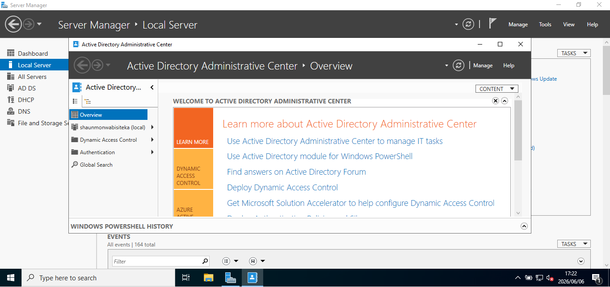

---

## 2️⃣ Identifying Critical Business Units

Reviewed the domain structure and identified departments requiring stronger password controls.

### Targeted Departments

- 💰 Finance
- 👥 Human Resources
- 💻 Information Communication Technology (ICT)

### 📸 Screenshot

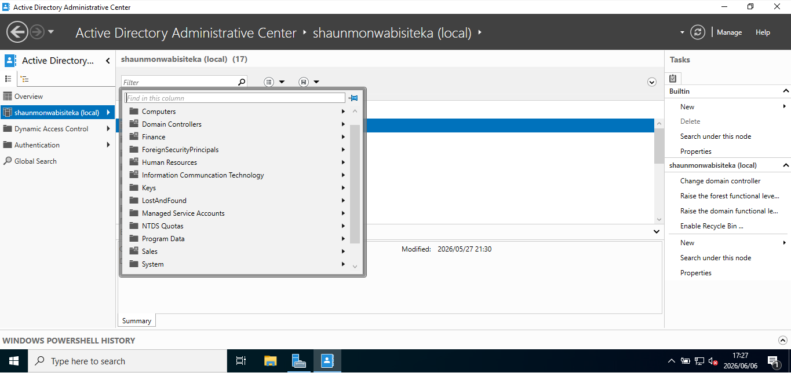

---

## 3️⃣ Creating a Password Settings Object (PSO)

Navigated to the Password Settings Container to create a new Fine-Grained Password Policy.

### Activities Performed

- Opened the domain
- Selected **System**
- Opened **Password Settings Container**
- Created a new Password Settings Object (PSO)

### 📸 Screenshot

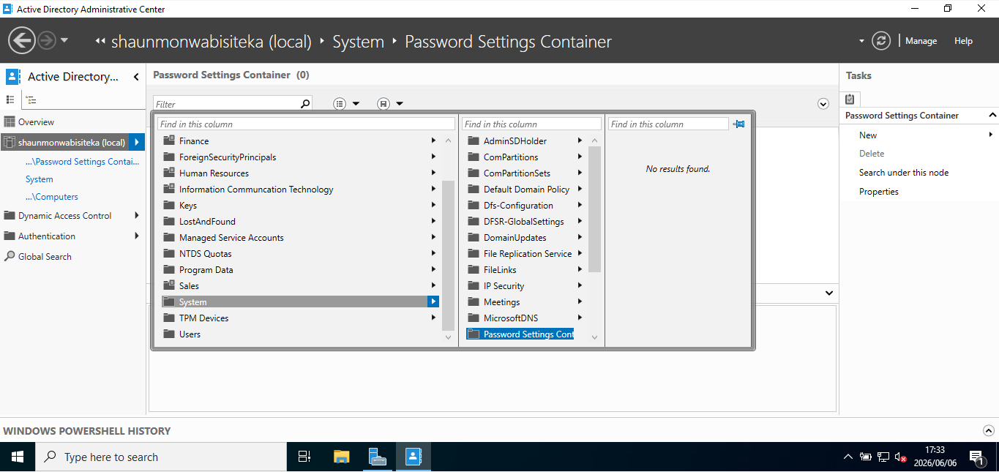

---

## 4️⃣ Configuring the Policy

Configured the new Password Settings Object and prepared it for deployment.

### Activities Performed

- Defined password requirements
- Configured account lockout settings
- Selected target groups and users

### 📸 Screenshot

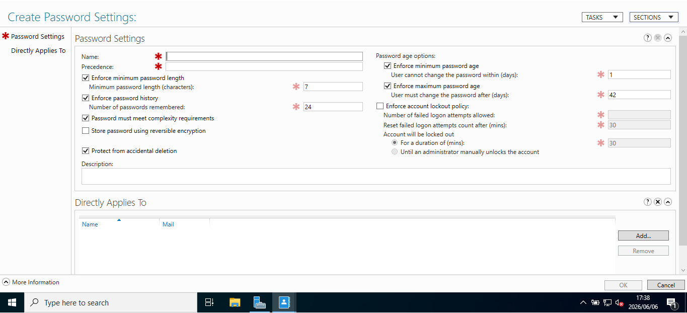

---

## 5️⃣ Implementing Security Controls

Configured enhanced password security requirements.

### 🔒 Security Settings Applied

| Setting | Configuration |
|----------|--------------|
| Precedence | 1 (Highest Priority) |
| Minimum Password Length | 15 Characters |
| Password History | 50 Previous Passwords |
| Maximum Password Age | 30 Days |
| Account Lockout | Enabled |
| Complexity Requirements | Enabled |

💡 **Note:** Fine-Grained Password Policies take precedence over standard domain password policies when applied to users or groups.

### 📸 Screenshot

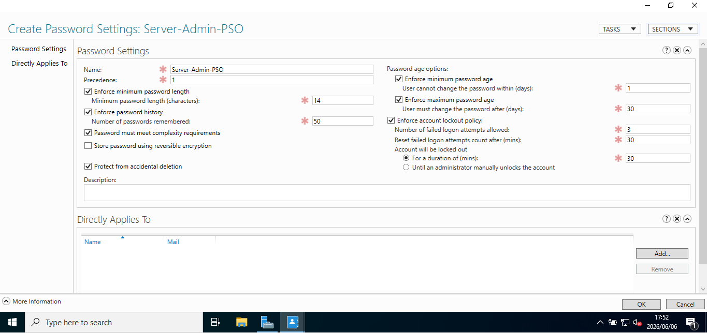

---

## 6️⃣ Selecting Target Groups

Selected the users and groups that would receive the enhanced password policy.

### 📸 Screenshot

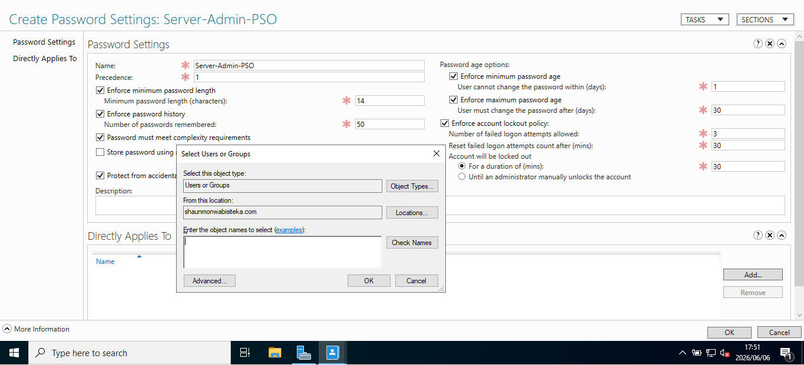

---

## 7️⃣ Applying the Policy

Applied the policy directly to critical business units.

### Groups Protected

- 💰 Finance
- 👥 Human Resources
- 💻 Information Communication Technology (ICT)

### 📸 Screenshot

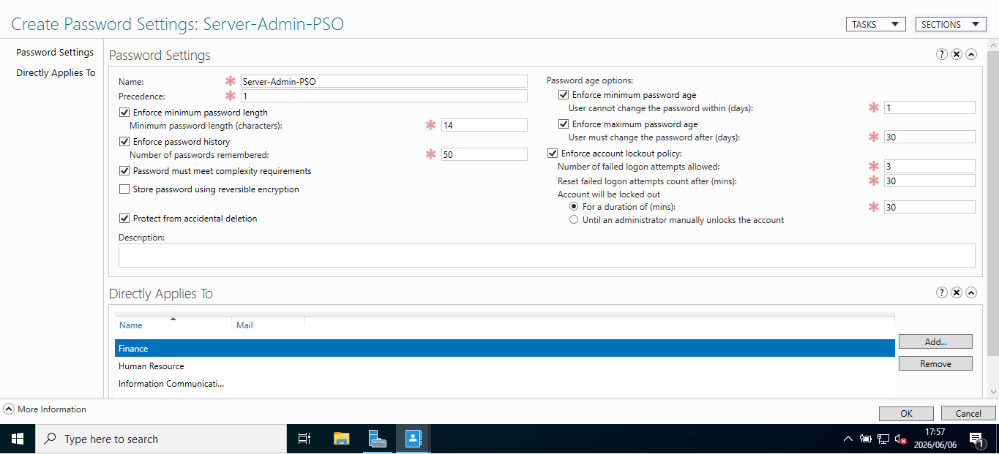

---

## 8️⃣ Verifying Policy Creation

Confirmed that the Password Settings Object was successfully created.

### Password Policy Name

**Server-Admin-PSO**

### 📸 Screenshot

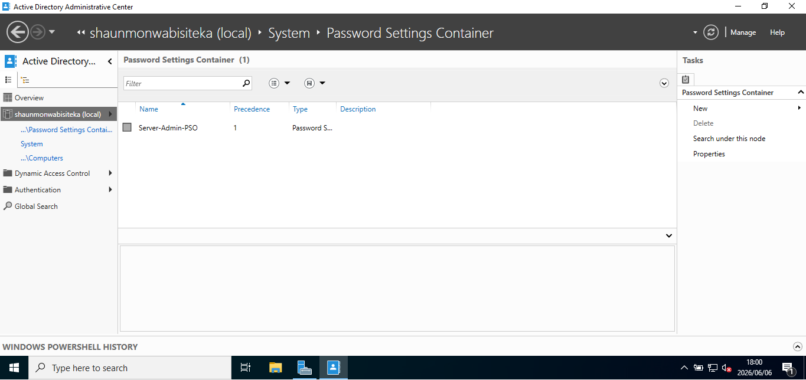

---

## 9️⃣ Testing Policy Enforcement

Validated whether the policy was successfully applied to users within the protected Organizational Units.

### Activities Performed

- Selected a Finance user account
- Attempted to reset the password
- Tested policy restrictions

### 📸 Screenshot

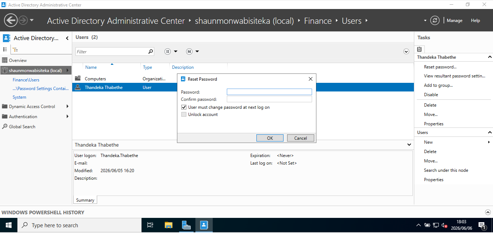

---

## 🔟 Testing a Weak Password

Attempted to use an insecure password:

```text
123Pass
```

### 📸 Screenshot

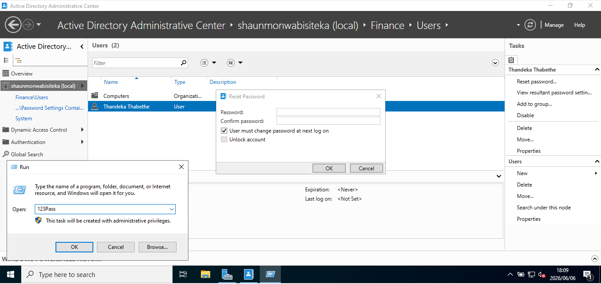

---

## 1️⃣1️⃣ Password Policy Enforcement

The password reset failed because the password did not meet organizational security requirements.

### Error Received

```text
The password does not meet the length, complexity,
or history requirements of the domain.
```

✅ This confirms that the policy is functioning correctly.

### 📸 Screenshot

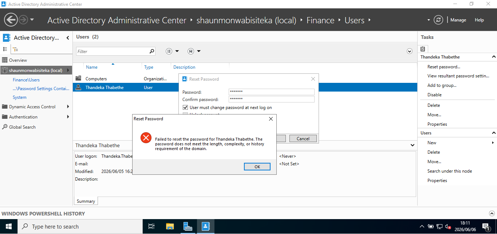

---

## 1️⃣2️⃣ Testing a Compliant Password

Attempted to use a stronger password that met the configured policy requirements.

### Password Used

```text
ShaunMonwabisi26
```

### 📸 Screenshot

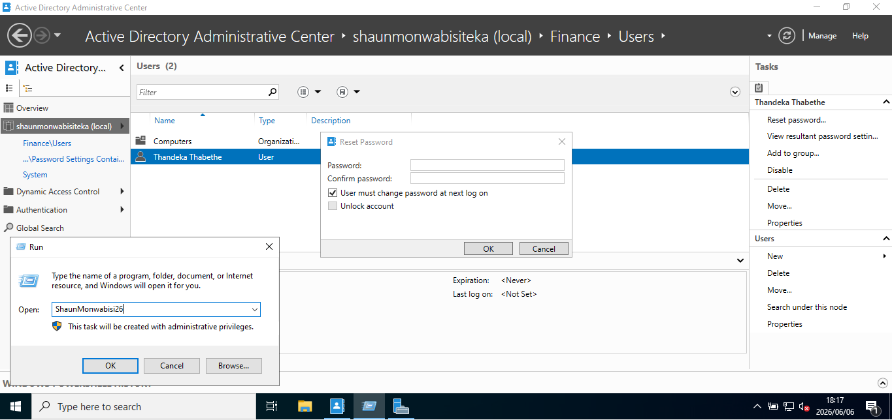

---

## 1️⃣3️⃣ Successful Password Reset

The password change was accepted successfully.

### Verification

- Password updated successfully
- User account modification timestamp updated

### 📸 Screenshot

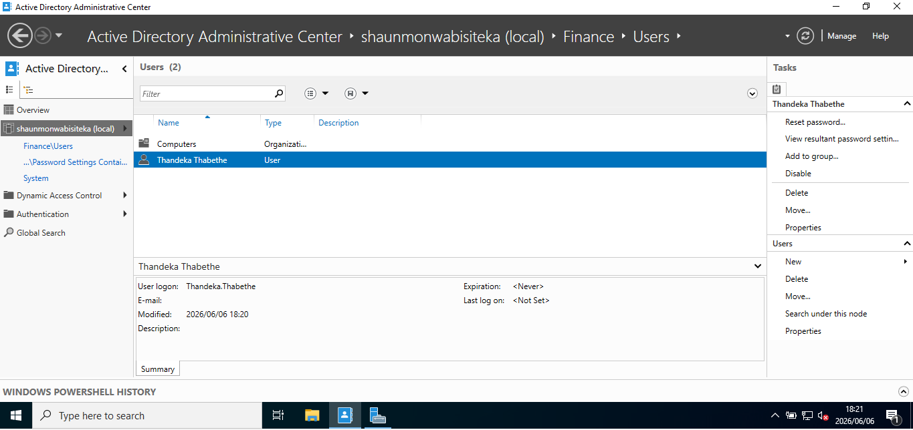

---

## 1️⃣4️⃣ Reviewing Applied Policies

Reviewed the Information Communication Technology (ICT) group properties.

### Activities Performed

- Opened ICT group properties
- Navigated to Password Settings

### 📸 Screenshot

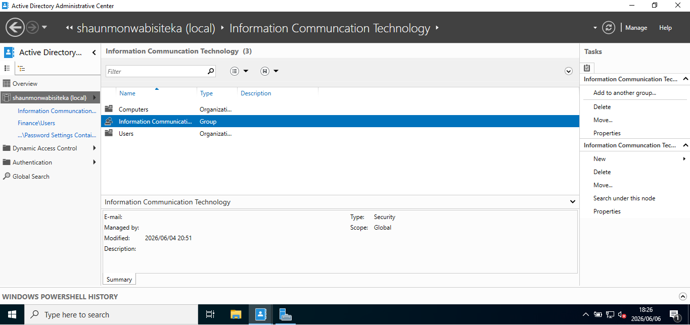

---

## 1️⃣5️⃣ Confirming Effective Policy

Verified that the correct Fine-Grained Password Policy was applied.

### Active Policy

**Server-Admin-PSO**

💡 Fine-Grained Password Policies override standard account password and lockout policies when applied to a user or group.

### 📸 Screenshot

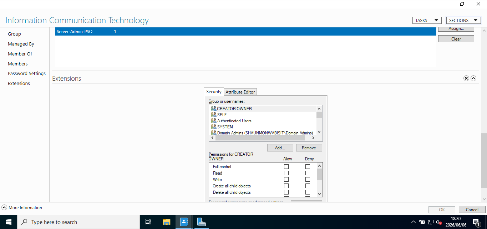

---

# 🚀 Skills Demonstrated

- Active Directory Administration
- Security Hardening
- Fine-Grained Password Policies (FGPP)
- Identity & Access Management (IAM)
- Account Lockout Configuration
- Password Security Management
- Enterprise Security Controls
- Windows Server Administration
- Security Policy Enforcement

---

# 📚 Lessons Learned

This lab strengthened my understanding of:

- Password security best practices
- Fine-Grained Password Policy implementation
- Active Directory security administration
- Account lockout strategies
- Security policy precedence
- Identity and access management
- Enterprise password management

---

# 🔮 Future Improvements

- Multi-Factor Authentication (MFA)
- Privileged Access Management (PAM)
- Passwordless Authentication
- Azure Active Directory Integration
- Conditional Access Policies
- Security Baseline Configuration
- Privileged Identity Management (PIM)
- Advanced Identity Protection

---

## ✅ Project Status

**Completed Successfully**

This project demonstrates practical experience with **Active Directory Security Hardening**, **Fine-Grained Password Policies**, **Identity & Access Management**, and **Enterprise Password Security Controls** within a simulated enterprise environment.
